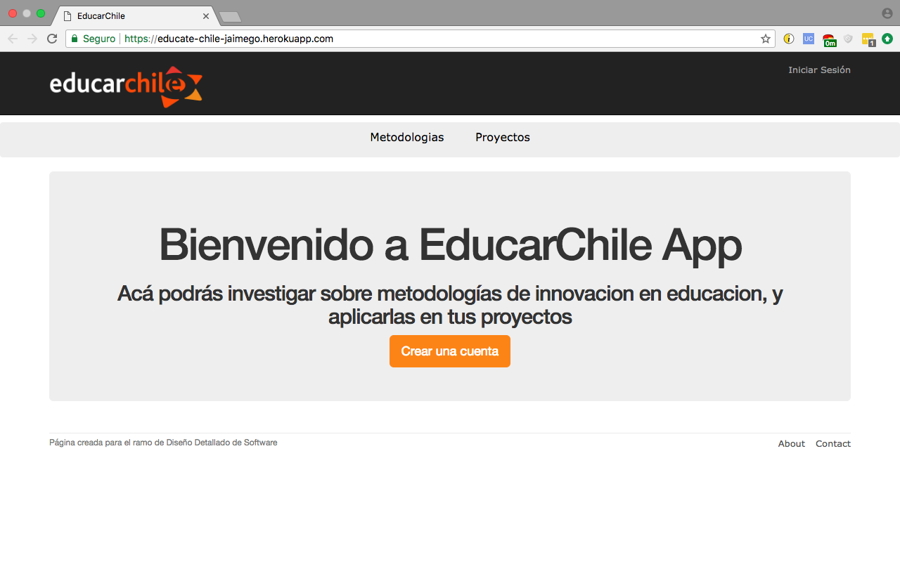
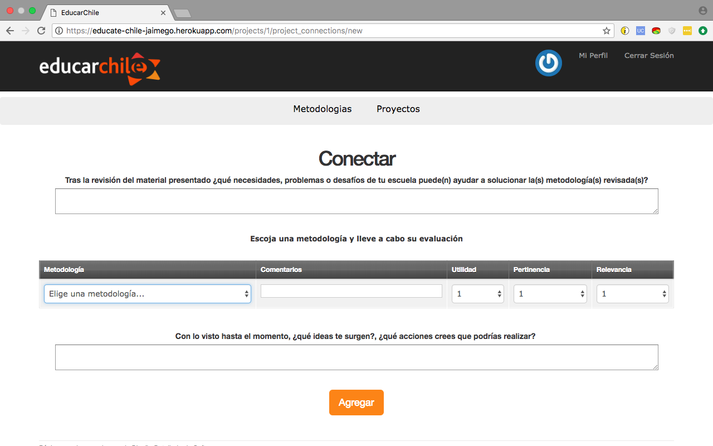

## Educate Chile ##

Available at Heroku: https://educate-chile-jaimego.herokuapp.com/

This app was developed in Ruby on Rails with Sqlite 3 for the course Detailed Software Design, at Pontificia Universidad Católica. 

It was created with agile methodologies in colaboration with other students. These are their Github usernames:

*caackermann
*cjsalame
*LeFranck
*noksenberg
*gdburky

The original repository is https://github.com/caackermann/dds

The purpose of the app is to teach school teachers to implement new approaches to further innovation in education. It was used as a starting point for the development of the corresponding area of the existing platform Educar Chile (http://www.educarchile.cl/) which features numerous resources for teachers across Chile.

It also supports standard functionality like registration and login, notifications, etc.

 Code standar: https://github.com/bbatsov/ruby-style-guide

# Screenshots

